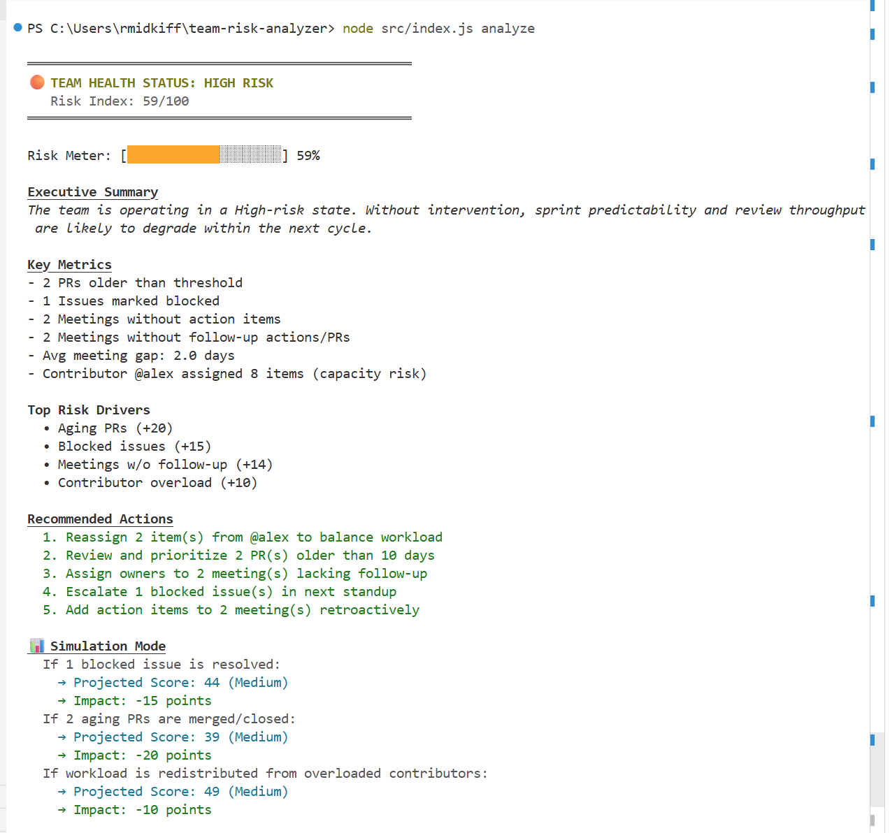
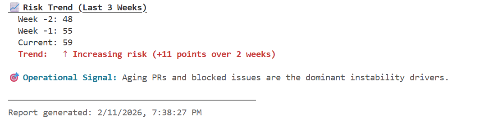
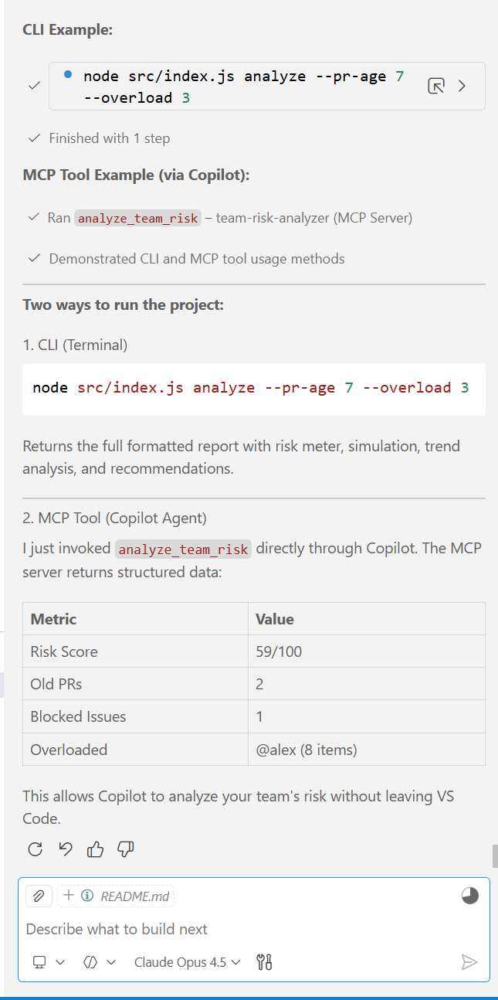

# Team Risk Analyzer

Team Risk Analyzer is an MCP-enabled CLI that analyzes PRs, issues, and meeting data to calculate a structured team risk score. Through an MCP server, GitHub Copilot can run these risk checks directly inside VS Code.

Teams generate large volumes of workflow data, but rarely turn it into actionable insight. This tool converts that activity into clear delivery health signals and recommended actions, without leaving the developer workflow.

## Overview

Team Risk Analyzer evaluates common delivery risk indicators such as:

- Aging open pull requests
- Blocked issues
- Meetings without action items
- Meetings without execution follow-up
- Contributor workload imbalance

These signals are combined into a weighted risk score (0–100) that reflects overall team stability and delivery risk

| Score | Level |
|-------|-------|
| 0–24 | Low |
| 25–49 | Medium |
| 50–79 | High |
| 80–100 | Critical |

The tool also generates recommended actions and simple what-if simulations to support decision-making. The analyzer can be run as a CLI or invoked through an MCP server, allowing GitHub Copilot to execute team risk analysis directly inside VS Code.

## Prerequisites

- Node.js >= 18.x

## Installation

Install dependencies:

```bash
npm install
```

## Usage

Run the analyzer:

```bash
node src/index.js analyze
```

Adjust thresholds:

```bash
node src/index.js analyze --pr-age 7 --overload 3
```

Output as Markdown:

```bash
node src/index.js analyze --format md
```

## CLI Options

| Option | Description | Default |
|--------|-------------|---------|
| `--pr-age <days>` | PR age threshold in days | `10` |
| `--overload <count>` | Assignment threshold for overload | `5` |
| `--format <type>` | Output format: `console` or `md` | `console` |

## Sample Output

```
══════════════════════════════════════════════════
🟠 TEAM HEALTH STATUS: HIGH RISK
   Risk Index: 59/100
══════════════════════════════════════════════════

Risk Meter: [🟧🟧🟧🟧🟧🟧🟧🟧🟧🟧🟧🟧⬜⬜⬜⬜⬜⬜⬜⬜] 59%

Executive Summary
The team is operating in a High-risk state. Without intervention,
delivery throughput and predictability may degrade.

Key Metrics
- 2 PRs older than threshold
- 1 Issues marked blocked
- 2 Meetings without action items
- 2 Meetings without follow-up actions/PRs
- Contributor @alex assigned 8 items (capacity risk)

Top Risk Drivers
  • Aging PRs (+20)
  • Blocked issues (+15)
  • Meetings w/o follow-up (+14)
  • Contributor overload (+10)

Recommended Actions
  1. Reassign 2 items from @alex to balance workload
  2. Review and prioritize 2 PRs older than 10 days
  3. Assign owners to 2 meetings lacking follow-up

📊 Simulation Mode
  If 1 blocked issue is resolved:
    → Projected Score: 44 (Medium)
    → Impact: -15 points

📈 Risk Trend (Last 3 Weeks)
  Week -2: 48
  Week -1: 55
  Current: 59
  Trend: ↑ Increasing risk (+11 points over 2 weeks)

🎯 Operational Signal: Aging PRs and blocked issues are the dominant
   instability drivers.
```

## Project Structure

```
src/
  index.js                  # CLI entry point
  services/riskAnalyzer.js  # Core analysis logic
  utils/reportFormatter.js  # Output formatting
  data/sampleGithub.json    # Sample PR/issue data
  data/sampleMeetings.json  # Sample meeting data

mcp/
  server.js                 # MCP server for Copilot integration
```

## Data Model

The project uses sample JSON data representing:

- **Pull requests** – status, author, createdAt
- **Issues** – labels, assignee
- **Meeting metadata** – date, hasActionItems

No credentials, PII, or external API keys are included.

## MCP Integration

The MCP server exposes a tool called `analyze_team_risk` that GitHub Copilot can invoke directly in VS Code.

### Setup

Add the following to your VS Code MCP settings (`.vscode/mcp.json` in the workspace or user settings):

```json
{
  "servers": {
    "team-risk-analyzer": {
      "type": "stdio",
      "command": "node",
      "args": ["mcp/server.js"],
      "cwd": "${workspaceFolder}"
    }
  }
}
```

Once configured, GitHub Copilot (Agent mode) can run team risk analysis by invoking the `analyze_team_risk` tool.

## How GitHub Copilot Was Used

- GitHub Copilot was used throughout the entire development process:
- Generated the initial CLI structure using Commander
- Assisted in implementing the core risk scoring engine
- Helped refine and tune the weighted risk driver model
- Generated executive summary and recommendation logic
- Assisted in building simulation and trend analysis features
- Supported MCP server implementation and tool schema definition
- Helped debug edge cases and improve output clarity
- Iteratively refined console formatting and risk visualization
- Copilot Chat and Agent mode were used inside VS Code to accelerate development, iterate on    feature ideas, and validate logic across multiple files.

## Demo Screenshots

### Full Risk Report View


### Simulation & Trend Analysis


### MCP Copilot Invocation


## License

ISC
